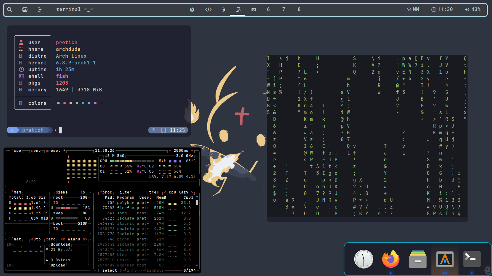

<h1 style="text-align=center;">MY DOTFILES</h1>

  
  

These are my dotfiles for bspwm (Arch Linux). This repo is in version 1.0 definitive, which added these features:
 
<li>Another branch; the main branch now became home to my old dots. New branch: newdots: home of my up-to-date dotfiles</li>
<li>Updated whole repo</li>
<li>Proper additions of picom, dunst, wlogout and general structure of dotfiles</li>

<h3>Screenshot</h3>

 
<h3>Video</h3>

There is also a video of me showcasing this rice in more detail

<a href="https://www.youtube.com/watch?v=DtEx1cwCp60&t=42s">Here</a>
 
<h3>Want to install?</h3>

Before you do anything, remember to install these packages if needed

<li>wlogout (AUR)</li>
<li><a href="https://github.com/alacritty/alacritty-theme">alacritty-theme</a></li>
<li>alacritty</li>
<li>dunst</li>
<li>polybar</li>
<li>papirus-icon-theme</li>
<li>rofi</li>
<li>nitrogen</li>
<li>pipewire-pulse</li>
<li>bspwm</li>
<li>ttf-jetbrainsmono-nerd</li>
<li>ttf-montserrat</li>
<li>starship</li>
<li>sxhkd</li>
<li>firefox</li>
<li><a href="https://github.com/pijulius/picom">pijulius's fork of picom</a></li>
<li>sddm (optional, you can just not copy the etc folder)</li>
<li>sddm-theme-tokyo-night-git (AUR) (only if you decided to also use sddm)</li>
 

If you want to install these dotfiles, follow these instructions.

1.
<code>git clone https://github.com/IDKnix/dotfiles</code>
 

2.
<code>mkdir .config.back</code> 

3.
<code>cp .config/* .config.back</code>

4.
<code>cp dotfiles/* .config/</code>

Obviously, accept any replacements (or you won't get the configs)

5.
<code>sudo cp dotfiles/etc/ /etc/</code>

6.
<code>cp dotfiles/home/ ~</code>

7.
<code>sudo cp dotfiles/usr/share/wlogout/icons/* /usr/share/wlogout/icons/</code>

<h5>TODO</h5>

Add install script

