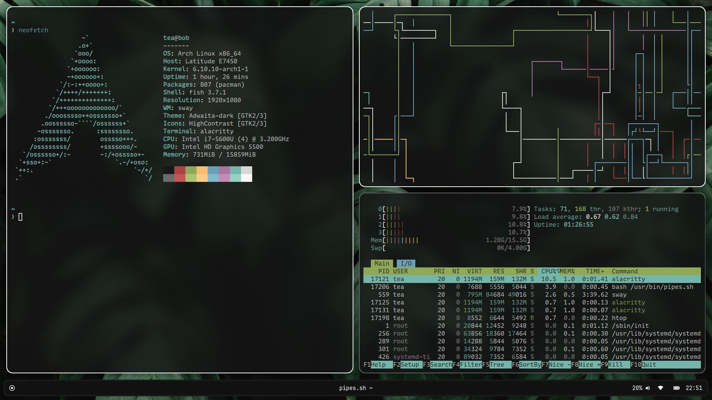
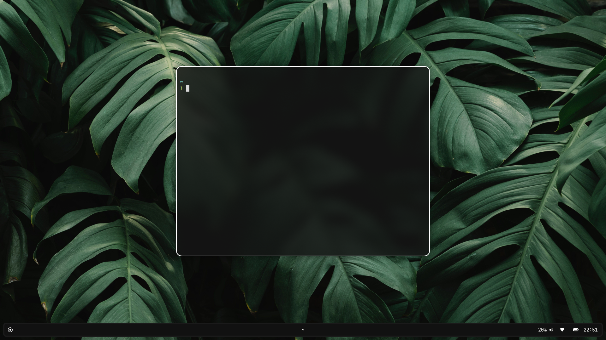

<h1 style="text-align=center;">MY DOTFILES</h1>

  
  

These are my dotfiles for Arch Linux on SwayFX. Features:

<li>Waybar</li>
<li>Alacritty</li>
<li>Starship</li>
<li>Yazi</li>
<li>Fish</li>

<h3>Screenshot</h3>

 

<h3>Want to install?</h3>

Before you do anything, remember to install these packages if needed

<li>alacritty</li>
<li>swaync</li>
<li>waybar</li>
<li>rofi</li>
<li>swayfx (AUR)</li>
<li>pipewire-pulse</li>
<li>rofi-lbonn-wayland (AUR)</li>
<li>ttf-jetbrainsmono-nerd</li>
<li>starship</li>
<li>firefox</li>
<li>sddm</li>
<li>sddm-astronaut-theme (AUR)</li>
<li>yazi</li>
<li>git</li>
 
